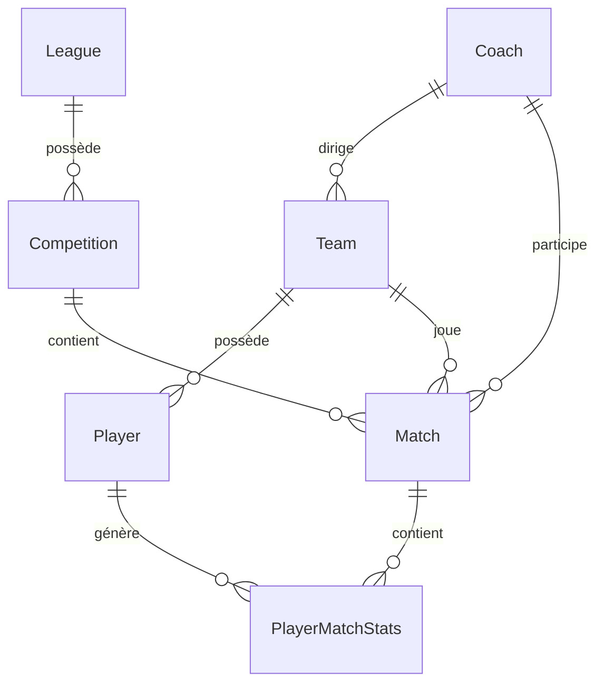

# 🧠 SneakySkink - Guide de Contexte Technique pour IA

Ce document est spécifiquement conçu pour servir de **contexte de haut niveau pour les agents IA (LLM)** travaillant sur l'écosystème SneakySkink. Il résume l'architecture Monorepo, les modèles de données, le traitement asynchrone, les configurations réseau critiques, et les règles de compilation.

---

## 🏢 1. Architecture Monorepo & Workspaces

L'écosystème est organisé sous forme de **Monorepo** piloté par les **NPM Workspaces** (défini dans le `package.json` racine). 

### Avantages Majeurs à intégrer :
* **Installation Mutualisée :** `npm install` à la racine installe et résout toutes les dépendances de tous les sous-dossiers de façon optimale.
* **Liaisons Symboliques (Symlinks) :** Les dépendances locales (`sneakyskink-bdd` et `sneakyskink-api-client`) sont automatiquement liées par NPM. Toute modification du SDK client ou du schéma BDD est visible à chaud par les autres projets sans réinstallation !
* **Exécution globale :** Des scripts globaux (`build:all`, `lint:all`) à la racine permettent de valider la compilation globale de l'écosystème.

---

## 🗄️ 2. Schéma de Données (Modèles Prisma)

La base de données PostgreSQL gérée par `sneakyskink-bdd` s'articule autour de 7 entités clés :



### Entités Majeures :
* **Coach :** Profil du joueur (ID Cyanide unique, pseudonyme, pays). Un système d'auto-découverte asynchrone détecte les nouveaux coachs inconnus lors de l'aspiration des rosters d'équipes et enfile un job pour charger leur profil complet.
* **Team :** Fiche d'équipe synchronisée à jour (Trésorerie `cash`, Apothicaire `apothecary`, Relances `rerolls`, Popularité, Staff).
* **Player :** Fiche de vie individuelle du joueur (Niveau, XP, compétences innées et acquises, blessures actives contractées `activeCasualties`).
* **Match :** Feuille de match immuable contenant les scores, la date de jeu, la ligue et la compétition concernées.
* **PlayerMatchStats :** Statistiques détaillées de performance d'un joueur spécifique au cours d'un match précis (blocages, passes, touchdowns, interceptions, blessures infligées/reçues, MVP).

---

## ⚡ 3. Architecture de la File d'Attente (BullMQ / Redis)

L'aspiration des données s'effectue via une architecture asynchrone pilotée par **BullMQ** dans le `SneakySkink-harvester` :

1. **Scheduler Récurrent (`scheduler.ts`) :** Un intervalle configuré par `SYNC_INTERVAL_MINUTES` (toutes les heures par défaut) scanne les ligues actives (`active: true`) et pousse des tâches de récupération globale (`fetch-league`) dans Redis.
2. **Workers BullMQ (`worker.ts`) :** Traite les tâches avec une concurrence de **1** pour garantir une exécution séquentielle et sécurisée du trafic API.
3. **Flux en Cascade :**
   * **`fetch-league`** : Récupère les métadonnées de la ligue, découvre ses compétitions, et enfile pour chacune un job `fetch-competition` s'il s'agit d'une compétition en cours de jeu. Il synchronise également le roster complet de chaque équipe inscrite dans la ligue.
   * **`fetch-competition`** : Récupère le calendrier de la compétition via `/contests`. Il effectue une déduplication en vérifiant si le match existe déjà localement en base de données. Si le match est manquant, il récupère la feuille de match complète via `/match`.
   * **`fetch-coach`** : Tâche asynchrone en arrière-plan chargée de peupler les métadonnées du profil d'un nouveau coach détecté.

---

## 🛡️ 4. Résilience API & Régulation (Rate Pacing)

La communication avec les serveurs de Cyanide s'effectue via la classe `BB3ApiClient` qui intègre des mesures de contournement et de résilience majeures :

* **Rate Pacer :** Un délai d'attente minimal configurable (`API_MIN_DELAY_MS`, recommandé à **2500ms**) est forcé entre chaque appel d'API pour éviter les saturations de serveurs.
* **Key Rotation (`api-key-manager.ts`) :** Le gestionnaire charge une liste de clés API configurée dans `CYANIDE_API_KEYS` (séparées par des virgules) et effectue une rotation à chaud.
* **Gestion du Cooldown :**
  * Si une clé rencontre une erreur HTTP `429 Rate Limit`, elle est passée en mode **Cooldown** pour une durée lue sur l'en-tête `Retry-After` (ou une durée par défaut de 15 minutes).
  * L'API Client passe instantanément et sans coupure applicative sur la clé valide suivante pour terminer le traitement en cours.
* **Tentatives et Backoff :** Chaque requête bénéficie de 3 tentatives de ré-exécution avec temporisation exponentielle en cas d'échecs réseau ou de timeout (60 secondes).

---

## 🔌 5. Le SDK Client Partagé (`sneakyskink-api-client`)

Pour éviter de dupliquer les appels d'API et les interfaces dans vos bots ou overlays, l'écosystème comprend un SDK client léger, compilé et prêt à l'emploi.

### Caractéristiques :
* **Axios Pré-configuré :** Gestion native des timeouts et de l'authentification (Bearers).
* **Entièrement Typé :** Ré-exporte et réutilise les modèles Prisma de `sneakyskink-bdd` pour typer à 100% les réponses d'API (`League`, `Match`, `Team`, etc.).
* **Facilité d'intégration :** S'installe en dépendance locale via `npm install ../sneakyskink-api-client`.

### Exemple d'intégration dans un Bot Discord :
```typescript
import { SneakySkinkApiClient } from 'sneakyskink-api-client';

const client = new SneakySkinkApiClient({ baseUrl: process.env.API_URL });
const coach = await client.getCoach('coach-id-abc');
console.log(coach.name); // Pseudonyme typé !
```

---

## 🎨 6. Design & Système Web (`SneakySkink-web`)

L'interface web est construite avec **Vite**, **React**, et **Material UI (MUI)**. Elle applique une charte graphique premium :
* **Esthétique :** Thème sombre profond (`#0B0F19`), panneau vitré en verre acrylique (glassmorphism), bordures néon personnalisées basées sur la couleur de la race Blood Bowl de l'équipe affichée.
* **Optimisation des Builds sous Windows :**
  * À cause d'un bug de packaging dans le package officiel `@mui/icons-material`, le fichier `vite.config.ts` possède un alias de résolution absolue pointant vers le fichier physique `index.js` :
    ```typescript
    resolve: {
      alias: [
        {
          find: '@mui/icons-material',
          replacement: path.resolve(__dirname, 'node_modules/@mui/icons-material/index.js'),
        }
      ]
    }
    ```
  * Toutes les icônes de l'application doivent être importées via le point d'entrée racine sous forme d'imports nommés :
    ```typescript
    import { Dashboard as DashboardIcon, EmojiEvents as TrophyIcon } from '@mui/icons-material';
    ```
  * Pour contourner les bugs de shells Windows avec npm, les scripts dans `package.json` appellent directement Node (`node node_modules/vite/bin/vite.js`).

---

## 🔗 7. Intégration de l'API REST (`SneakySkink-api`)

L'API Express expose des routes pour le frontend et le bot Discord, notamment :
* `GET /sync/queue` : Permet de monitorer en temps réel l'activité de BullMQ (nombre de jobs actifs et en attente).
* `POST /sync/coach/:id` : Ajoute un job à BullMQ pour synchroniser immédiatement un coach spécifique.
* `POST /sync/league/:id` : Force l'aspiration complète d'une ligue sur demande administrative.
* `GET /matches` : Historique paginé et filtré des matchs.
* `GET /coaches/:id` : Détails d'un coach avec l'ensemble de ses équipes enregistrées.
