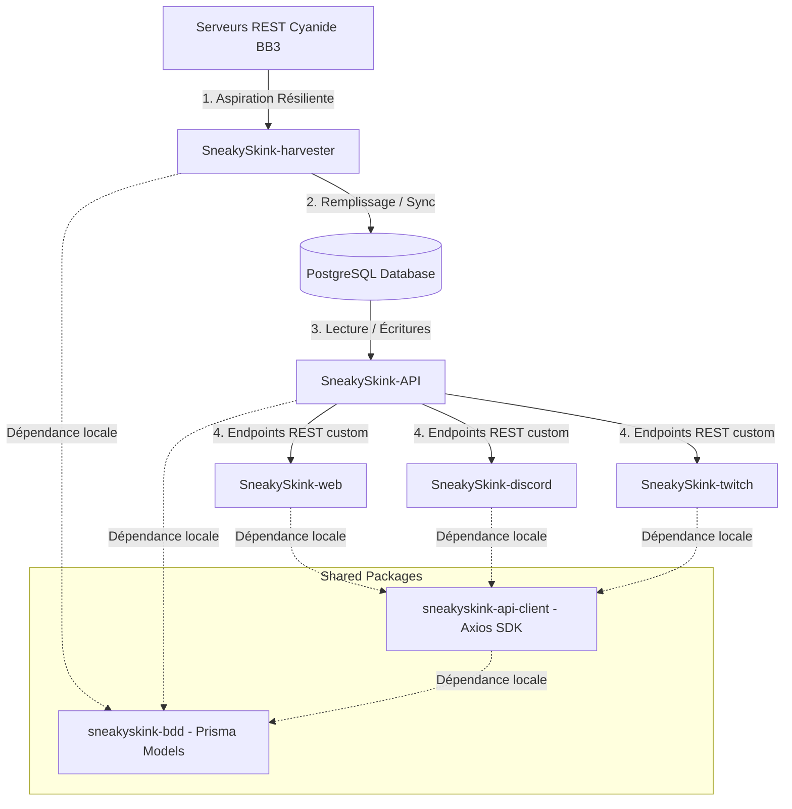
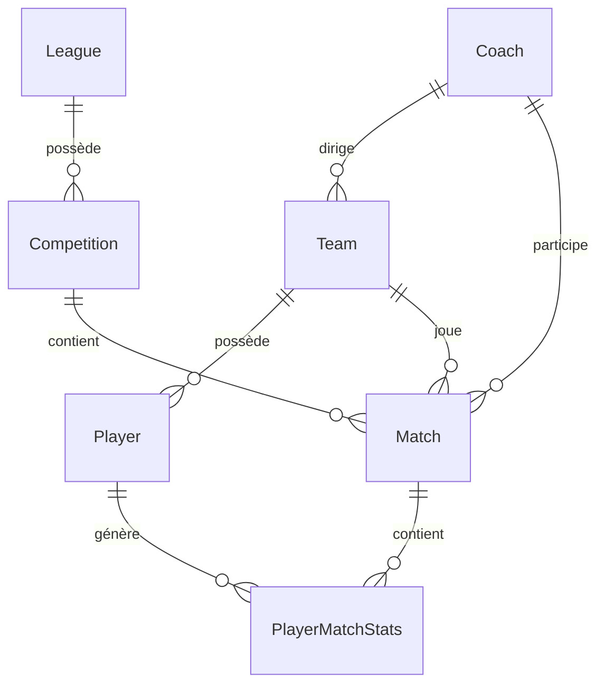

# 🦎 SNEAKYSKINK - ECOSYSTEM BLUEPRINT & AI CONTEXT GUIDE

Ce document fait office de **mémoire technique, plan d'architecture global et guide de transition** pour permettre à tout assistant IA (comme Antigravity) de reprendre instantanément le développement au sein de l'écosystème **SneakySkink** (le système d'aspiration, de traitement de données, d'API REST et d'applications pour Blood Bowl 3).

---

## 1. Vision Globale & Écosystème Multi-Packages

L'écosystème SneakySkink est structuré en **Monorepo** piloté par les **NPM Workspaces** (défini à la racine). Cela permet d'unifier l'installation, de gérer de manière transparente les liaisons symboliques (symlinks) locales entre packages, et de simplifier la validation globale.



### Statut des 7 packages de l'Écosystème :

1. **`sneakyskink-bdd` (TypeScript - 100% OPÉRATIONNEL) :**
   * Source unique de vérité pour le schéma de données. Gère la base PostgreSQL via Prisma et compile le client Prisma partagé.
2. **`sneakyskink-api-client` (TypeScript - 100% OPÉRATIONNEL) :**
   * SDK client réutilisable et typé. Il ré-exporte les modèles Prisma et expose des méthodes de requêtes pour l'application Web et les futurs bots.
3. **`SneakySkink-harvester` (TypeScript - 100% OPÉRATIONNEL) :**
   * Démon autonome chargé de l'aspiration des données depuis l'API de Cyanide. Intègre une file d'attente prioritaire (BullMQ) et une gestion résiliente des quotas de l'API.
4. **`SneakySkink-api` (TypeScript - 100% OPÉRATIONNEL) :**
   * API REST custom (Express) hautement optimisée. Expose des endpoints simplifiés et rapides, et pousse des demandes de synchronisation immédiate vers Redis.
5. **`SneakySkink-web` (React/Vite/MUI - 100% OPÉRATIONNEL) :**
   * Site web premium au design moderne et dynamique (thème sombre, glassmorphism, micro-animations) affichant les classements, profils, statistiques et feuilles de matchs.
6. **`SneakySkink-discord` (TypeScript - NON DÉVELOPPÉ) :**
   * Squelette de dossier initialisé. Bot interactif pour notifier les matchs, montées de niveau des joueurs, blessures, et afficher des fiches d'équipes.
7. **`SneakySkink-twitch` (TypeScript - NON DÉVELOPPÉ) :**
   * Squelette de dossier initialisé. Bot interactif pour interagir avec les streams des coachs durant les matchs officiels.

---

## 2. Modélisation de la Base de Données PostgreSQL (`sneakyskink-bdd`)

La base de données PostgreSQL gérée par `sneakyskink-bdd` s'articule autour de 7 entités clés liées :



### Le Schéma Prisma (`prisma/schema.prisma`) :

```prisma
datasource db {
  provider = "postgresql"
  url      = env("DATABASE_URL")
}

generator client {
  provider   = "prisma-client-js"
  engineType = "library"
}

model League {
  id           String        @id // UUID Cyanide
  name         String
  logo         String?
  gamerCount   Int?          @map("gamer_count")
  active       Boolean       @default(true)
  createdAt    DateTime      @default(now()) @map("created_at")
  updatedAt    DateTime      @updatedAt @map("last_update")
  competitions Competition[]
  matches      Match[]

  @@map("leagues")
}

model Competition {
  id                 String   @id // UUID Cyanide
  name               String
  format             String   // "Knockout" | "RoundRobin" | "Wissen" | "Ladder"
  status             String   // "InProgress" | "Scheduled" | "Played" | "Validated"
  round              Int?
  roundsCount        Int?     @map("rounds_count")
  turnDuration       Int      @map("turn_duration")
  timeBonusDuration  Int      @map("time_bonus_duration")
  teamsMax           Int?     @map("teams_max")
  teamsCount         Int?     @map("teams_count")
  leagueId           String   @map("league_id")
  league             League   @relation(fields: [leagueId], references: [id], onDelete: Cascade)
  matches            Match[]
  createdAt          DateTime @default(now()) @map("created_at")
  updatedAt          DateTime @updatedAt @map("last_update")

  @@map("competitions")
}

model Coach {
  id           String   @id // UUID Cyanide (idcoach)
  name         String
  lastLang     String?  @map("last_lang")
  country      String?
  twitch       String?
  youtube      String?
  teams        Team[]
  homeMatches  Match[]  @relation("HomeCoach")
  awayMatches  Match[]  @relation("AwayCoach")
  createdAt    DateTime @default(now()) @map("created_at")
  updatedAt    DateTime @updatedAt @map("last_update")

  @@map("coaches")
}

model Team {
  id                String   @id // UUID Cyanide
  name              String
  raceId            Int      @map("race_id") // ID technique de race (ex: 12 = Amazon, 18 = Nurgle)
  logo              String?
  value             Int      // Valeur d'Équipe (TV) en k (ex: 1280)
  cash              Int      // Trésorerie en pièces d'or
  cheerleaders      Int      @default(0)
  assistantCoaches  Int      @default(0) @map("assistant_coaches")
  popularity        Int      @default(0)
  rerolls           Int      @default(0)
  apothecary        Int      @default(0)
  wins              Int      @default(0)
  draws             Int      @default(0)
  losses            Int      @default(0)
  score             Int      @default(0)
  coachId           String   @map("coach_id")
  coach             Coach    @relation(fields: [coachId], references: [id])
  players           Player[]
  homeMatches       Match[]  @relation("HomeTeam")
  awayMatches       Match[]  @relation("AwayTeam")
  createdAt         DateTime @default(now()) @map("created_at")
  updatedAt         DateTime @updatedAt @map("last_update")

  @@map("teams")
}

model Player {
  id                  String             @id // UUID Cyanide
  name                String?
  number              Int                // Numéro de maillot (1 à 16)
  value               Int                // Valeur individuelle
  xp                  Int                @default(0)
  level               Int                @default(1)
  type                String             // Positional (ex: "amazon_humanBlocker")
  status              String             @default("ACTIVE") // "ACTIVE" | "RETIRED" | "DEAD"
  suspendedNextMatch  Boolean            @default(false) @map("suspended_next_match")
  ma                  Int                
  st                  Int                
  ag                  Int                
  pa                  Int                
  av                  Int                
  innateSkills        String[]           @map("innate_skills")
  acquiredSkills      String[]           @map("acquired_skills")
  activeCasualties    String[]           @map("active_casualties")
  teamId              String             @map("team_id")
  team                Team               @relation(fields: [teamId], references: [id], onDelete: Cascade)
  matchStats          PlayerMatchStats[]
  createdAt           DateTime           @default(now()) @map("created_at")
  updatedAt           DateTime           @updatedAt @map("last_update")

  @@map("players")
}

model Match {
  id              String             @id // UUID Cyanide
  startedAt       DateTime           @map("started_at")
  finishedAt      DateTime           @map("finished_at")
  round           Int                
  platform        String             
  status          String             
  leagueId        String             @map("league_id")
  league          League             @relation(fields: [leagueId], references: [id])
  competitionId   String             @map("competition_id")
  competition     Competition        @relation(fields: [competitionId], references: [id], onDelete: Cascade)
  homeTeamId      String             @map("home_team_id")
  homeTeam        Team               @relation("HomeTeam", fields: [homeTeamId], references: [id])
  awayTeamId      String             @map("away_team_id")
  awayTeam        Team               @relation("AwayTeam", fields: [awayTeamId], references: [id])
  homeCoachId     String?            @map("home_coach_id")
  homeCoach       Coach?             @relation("HomeCoach", fields: [homeCoachId], references: [id])
  awayCoachId     String?            @map("away_coach_id")
  awayCoach       Coach?             @relation("AwayCoach", fields: [awayCoachId], references: [id])
  homeScore       Int                @map("home_score")
  awayScore       Int                @map("away_score")
  homeStats       Json?              @map("home_stats")
  awayStats       Json?              @map("away_stats")
  playerStats     PlayerMatchStats[]
  createdAt       DateTime           @default(now()) @map("created_at")
  updatedAt       DateTime           @updatedAt @map("last_update")

  @@map("matches")
}

model PlayerMatchStats {
  id                String   @id @default(uuid())
  matchId           String   @map("match_id")
  match             Match    @relation(fields: [matchId], references: [id], onDelete: Cascade)
  playerId          String   @map("playerId")
  player            Player   @relation(fields: [playerId], references: [id], onDelete: Cascade)
  teamId            String   @map("team_id")
  matchPlayed       Boolean  @default(true) @map("match_played")
  mvp               Boolean  @default(false)
  xpGained          Int      @default(0) @map("xp_gained")
  touchdowns        Int      @default(0)
  passes            Int      @default(0)
  catches           Int      @default(0)
  interceptions     Int      @default(0)
  yardsRunning      Int      @default(0) @map("yards_running")
  yardsPassing      Int      @default(0) @map("yards_passing")
  blocksSucceeded   Int      @default(0) @map("blocks_succeeded")
  blocksSustained   Int      @default(0) @map("blocks_sustained")
  armourBreaks      Int      @default(0) @map("armour_breaks")
  tackles           Int      @default(0)
  pushouts          Int      @default(0)
  casualtiesInflicted Int    @default(0) @map("casualties_inflicted")
  koInflicted         Int    @default(0) @map("ko_inflicted")
  injuriesInflicted   Int    @default(0) @map("injuries_inflicted")
  deadInflicted       Int    @default(0) @map("dead_inflicted")
  casualtiesSustained Int    @default(0) @map("casualties_sustained")
  koSustained         Int    @default(0) @map("ko_sustained")
  injuriesSustained   Int    @default(0) @map("injuries_sustained")
  deadSustained       Int    @default(0) @map("dead_sustained")
  newCasualties       String[] @map("new_casualties")
  createdAt         DateTime @default(now()) @map("created_at")
  updatedAt         DateTime @updatedAt @map("last_update")

  @@map("player_match_stats")
}
```

---

## 3. Architecture du Harvester (`SneakySkink-harvester`)

Le Harvester est un démon autonome résilient chargé d'aspirer les données du jeu depuis l'API de Cyanide et de les persister dans PostgreSQL.

### Ingestion Résiliente & Rate Pacing
* **Rate Pacer :** Pour éviter les saturations et bannissements, un délai minimal incompressible (configuré par `API_MIN_DELAY_MS` à **2500ms** par défaut) est forcé entre chaque appel d'API.
* **ApiKeyManager (`api-key-manager.ts`) :** Charge une liste de clés API configurées dans `CYANIDE_API_KEYS` (séparées par des virgules) et effectue une rotation à chaud.
* **Cooldown automatique :** Si une clé rencontre une erreur HTTP `429 Rate Limit`, elle passe en veille pour la durée recommandée dans l'en-tête `Retry-After` (ou 15 minutes par défaut). L'API Client bascule automatiquement sur la clé suivante valide.
* **Déduplication proactive :** Le Harvester vérifie localement en base si un match existe déjà (via son identifiant unique de match immuable) avant d'interroger l'API Cyanide pour la feuille de match complète.

### Traitement Asynchrone (BullMQ & Redis)
Le Harvester s'appuie sur une file d'attente pilotée par BullMQ dans Redis :
* **Concurrence :** Fixée à **1** pour le worker BullMQ afin de garantir l'exécution séquentielle stricte de tous les appels à l'API de Cyanide.
* **Niveaux de Priorité (BullMQ) :**
  * **Priorité Haute (1) :** Requêtes à la demande émises par l'API (ex: découverte immédiate d'un coach, ajout de ligue).
  * **Priorité Moyenne (5) :** Boucle de synchronisation standard planifiée.
  * **Priorité Basse (10) :** Imports de masse ou historiques (bulk imports).
* **Cascade de tâches :**
  1. **`fetch-league`** : Récupère les métadonnées de la ligue, met à jour le roster complet des équipes associées et enfile pour chaque compétition en cours un job `fetch-competition`.
  2. **`fetch-competition`** : Interroge `/contests` pour cette compétition, déduplique les matchs déjà importés et récupère les détails via `/match`. Découvre également de nouveaux coachs.
  3. **`fetch-coach`** : Récupère en tâche de fond le profil complet et les informations d'un coach inconnu.

### Planification (Scheduler)
Un planificateur interne configuré par `SYNC_INTERVAL_MINUTES` (par défaut toutes les **90 minutes / 1h30**) balaie les ligues marquées `active: true` et envoie un job `fetch-league` (priorité moyenne) pour chacune. Un script npm dédié (`npm run sync:now`) permet de forcer instantanément une synchronisation.

---

## 4. API REST Custom (`sneakyskink-api`)

Le package `sneakyskink-api` est un serveur Express écrit en TypeScript connecté à PostgreSQL via le client Prisma de `sneakyskink-bdd`. Il sert de passerelle d'accès rapide et permet de piloter la file d'attente BullMQ.

### Endpoints Disponibles :
* **Index & État :** `GET /` (retourne la version et un comptage global des entités de la BDD).
* **Ligues :** `GET /leagues`, `GET /leagues/:id`.
* **Compétitions :** `GET /competitions`, `GET /competitions/:id`.
* **Équipes :** `GET /teams`, `GET /teams/:id` (détails de l'équipe et fiches joueurs du roster).
* **Coachs :** `GET /coaches`, `GET /coaches/:id`.
* **Matchs :** `GET /matches` (historique paginé), `GET /matches/:id` (détail complet et statistiques de performances des joueurs).
* **Synchronisation :**
  * `GET /sync/queue` : Statistiques de la file d'attente BullMQ (jobs en attente, actifs, complétés, en échec) ainsi que l'état d'activité du Harvester et l'accessibilité de l'API de Cyanide.
  * `POST /sync/coach/:id` : Ajoute un job à la file d'attente en priorité Haute pour synchroniser immédiatement un coach.
  * `POST /sync/league/:id` : Force la synchronisation immédiate d'une ligue en priorité Haute.
* **Statistiques (`/stats/...`) :**
  * `GET /stats/global` : Données globales d'activité.
  * `GET /stats/activity` : Activité récente (matchs par jour).
  * `GET /stats/coach/:id` : Statistiques de performances d'un coach (winrate global, sur les 30 derniers matchs, par race, face-à-face, etc.).
  * `GET /stats/competition/:id` : Statistiques d'une compétition.
  * `GET /stats/league/:id` : Statistiques d'une ligue.

---

## 5. Le SDK Client Partagé (`sneakyskink-api-client`)

Pour éviter la duplication des appels REST et des interfaces TypeScript au sein des différents projets (web, bot Discord, etc.), le package `sneakyskink-api-client` compile un SDK prêt à l'emploi.

### Caractéristiques :
* **Axios configuré :** Gère nativement les timeouts, les Bearers et les configurations de base.
* **Entièrement Typé :** Ré-exporte et type les réponses d'API avec les entités de `sneakyskink-bdd`.
* **Installation Locale :** Référencé dans les workspaces du monorepo via `"sneakyskink-api-client": "*"`.

### Exemple de consommation :
```typescript
import { SneakySkinkApiClient } from 'sneakyskink-api-client';

const client = new SneakySkinkApiClient({ baseUrl: 'http://localhost:3001' });

// Récupérer le statut
const status = await client.getStatus();
console.log(`L'API est ${status.status} (Version ${status.version})`);

// Récupérer une équipe
const team = await client.getTeam('uuid-equipe');
console.log(`Nom du coach: ${team.coach.name}`);
```

---

## 6. Interface Web (`SneakySkink-web`)

L'application web est construite en React/Vite/MUI et communique uniquement avec l'API REST locale via le SDK partagé `sneakyskink-api-client`.

### Architecture Graphique & Principes
* **Design Mobile-First :** Pensé en priorité pour les mobiles.
* **Esthétique Néon-Sombre & Glassmorphism :** Fond sombre profond (`#0B0F19`), panneaux transparents en effet verre dépoli, et bordures néons thématiques (qui s'adaptent dynamiquement à la couleur de la race de l'équipe affichée).
* **Simplicité & Clarté :** Pas de requêtes brutes vers Cyanide ou le Harvester.

### Pages Implémentées :
1. **Accueil (`/`) :** Indicateurs de santé (API Cyanide, Harvester), barre de recherche globale, graphique Recharts d'activité (matchs/24h) et statistiques globales.
2. **Recherche (`/search`) :** Résultats filtrés par catégories (Ligues, Compétitions, Coachs, Équipes). Si un seul résultat exact existe, redirige instantanément vers la fiche.
3. **Coachs (`/coachs`) & Profil Coach (`/coach/[id]`) :** Détails, derniers matchs, équipes, graphiques Recharts d'évolution de winrate et répartition horaire des matchs joués, ainsi que la liste des face-à-face triée.
4. **Ligues (`/ligues`) & Détail Ligue (`/ligue/[id]`) :** Métadonnées, liste de compétitions, coachs et derniers matchs.
5. **Compétitions (`/competitions`) & Détail Compétition (`/competition/[id]`) :** S'adapte au format de la compétition (classement complet Toutes Rondes / Suisse avec tie-breakers paramétrables OU Bracket graphique interactif).
6. **Équipe (`/equipe/[id]`) :** Roster des joueurs détaillant les caractéristiques (MA, ST, AG, PA, AV), XP, compétences de départ, compétences acquises et blessures courantes.
7. **Match (`/match/[id]`) :** Fiche de match interactive et chronologie d'événements physiques (blessures, KO) et de jeu (TD, passes).
8. **Synchro (`/synchro`) :** Formulaire minimaliste pour soumettre une demande de synchronisation rapide.
9. **Not Found (`/not-found`) :** Redirection 404 soignée.

### Spécificités de Build & Compatibilité Windows
* **Alias MUI Icons :** En raison d'un bug de packaging sur `@mui/icons-material`, le fichier `vite.config.ts` contient un alias de résolution absolue pointant vers `index.js`. **Toutes les icônes doivent être importées via le point d'entrée racine :**
  ```typescript
  import { Dashboard as DashboardIcon, EmojiEvents as TrophyIcon } from '@mui/icons-material';
  ```
* **Scripts npm :** Pour contourner les bugs d'exécution de scripts des shells Windows, les commandes npm de `package.json` lancent directement Node.js :
  ```json
  "dev": "node node_modules/vite/bin/vite.js --port 3000 --host"
  ```

---

## 7. Instructions d'Administration & Commandes

### Lancement Rapide (3 Terminaux Simultanés) :
* **Option A (VSCode) :** `Ctrl + Shift + P` -> `Tasks: Run Task` -> `🚀 Start All Services (3 Terminals)`.
* **Option B (PowerShell Windows) :** Clic droit sur le fichier `start-dev.ps1` à la racine -> `Exécuter avec PowerShell`.

### Commandes Utiles :
* **Démarrage manuel :**
  * Harvester : `npm run dev -w SneakySkink-harvester`
  * API REST : `npm run dev -w SneakySkink-api`
  * Interface Web : `npm run dev -w SneakySkink-web`
* **Compilation & Linting Globaux :**
  * Installer tout : `npm install`
  * Compiler tout : `npm run build:all`
  * Linter tout : `npm run lint:all`
* **Tests unitaires (Harvester) :**
  * `npm run test:parsers -w SneakySkink-harvester` (exécute les validations de parsing sur payloads réels).
* **Forcer une synchronisation Redis immédiate :**
  * `npm run sync:now -w SneakySkink-harvester`
