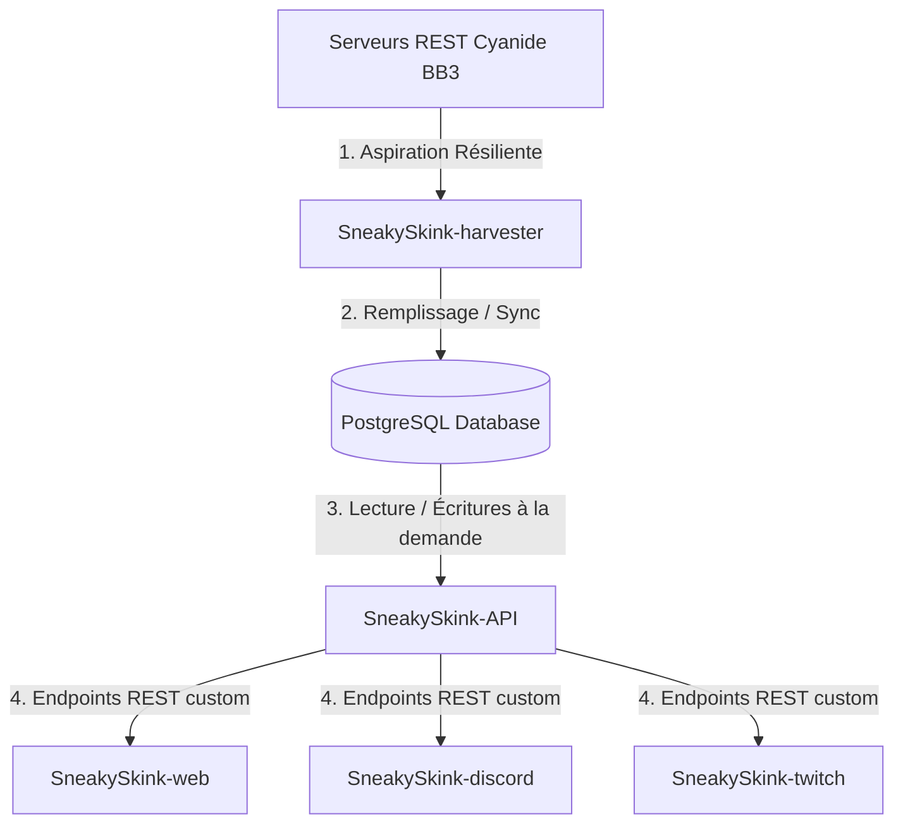

# 🦎 SNEAKYSKINK - ECOSYSTEM BLUEPRINT & ONBOARDING

Bienvenue sur le plan d'architecture global de **SneakySkink**, l'écosystème ultime de traitement, d'API et d'applications pour Blood Bowl 3 (BB3).

Ce document fait office de **mémoire technique et de guide de transition** pour permettre à tout assistant IA (comme Antigravity) de reprendre instantanément le pair programming avec le USER dans une nouvelle session ou dans un nouveau dépôt, sans perte de contexte.

---

## 1. Vision Globale & Écosystème Multi-Repos

Pour garantir une indépendance totale et une modularité maximale, le projet est découpé en 5 dépôts distincts :



### Les 5 Dépôts de l'Écosystème :
1. **`SneakySkink-harvester` (Node.js/TypeScript - 100% COMPLÉTÉ) :**
   * Démon autonome chargé de l'aspiration des données (ligues, compétitions, rosters, matchs) depuis l'API de Cyanide.
   * Stocke et met à jour de façon transactionnelle une base de données PostgreSQL partagée.
2. **`SneakySkink-API` (Prochain dépôt - Express/NestJS) :**
   * API REST custom hautement optimisée. 
   * Expose des endpoints simplifiés et rapides pour lire les ligues, coachs, équipes, matchs, et statistiques des joueurs.
   * Permet aux bots et à l'application web de pousser des demandes en priorité haute vers la file d'attente Redis du Harvester.
3. **`SneakySkink-web` (React/Next.js mobile-first) :**
   * Site web premium au design moderne et dynamique (glassmorphism, micro-animations) affichant les classements, fiches de coachs, statistiques détaillées et feuilles de matchs.
4. **`SneakySkink-discord` (Bot Discord) :**
   * Bot interactif pour notifier les matchs joués, les montées de niveau des joueurs, les blessures et afficher des fiches d'équipes.
5. **`SneakySkink-twitch` (Bot Twitch) :**
   * Bot interactif pour interagir avec les streams des coachs durant les matchs officiels.

---

## 2. État du Premier Dépôt : `SneakySkink-harvester` (Terminé & Validé)

Le Harvester est entièrement opérationnel, autonome et structuré pour la production.

### A. Fonctionnalités Clés Implémentées :
* **🔑 Gestion résiliente des quotas d'API :** `ApiKeyManager` gère la rotation des clés, les cooldowns automatiques et respecte les limites (1 000 req/h et 10 000 req/j).
* **🧬 Parseurs robustes :** Traduction transactionnelle des payloads bruts de Cyanide vers les modèles PostgreSQL.
* **⚡ File d'attente prioritaire (BullMQ & Redis) :**
  - **Priorité Haute (1) :** Pour les requêtes urgentes de coachs, ligues ou compétitions absents de la BDD.
  - **Priorité Moyenne (5) :** Pour la boucle de synchronisation standard périodique.
  - **Priorité Basse (10) :** Pour les bulk imports.
* **⏰ Synchronisation configurable & manuelle :** Intervalle par défaut configuré à **1h30** (configurable dans le `.env`). Raccourci `npm run sync:now` pour forcer une synchro immédiate.

### B. Commandes Utiles :
* `npm run dev` : Démarre le démon Harvester en mode de surveillance (watch).
* `npm run build` : Compile le projet (TypeScript strict - zéro erreur).
* `npm run test:parsers` : Exécute la suite de tests de validation unitaire sur payloads réels.
* `npm run sync:now` : Envoie instantanément les jobs de synchronisation dans Redis.

---

## 3. Modélisation de la Base de Données PostgreSQL

Le schéma Prisma standardisé utilise des conventions PostgreSQL (`created_at` et `last_update` automatiques).

```prisma
// Fichier : prisma/schema.prisma

datasource db {
  provider = "postgresql"
  url      = env("DATABASE_URL")
}

generator client {
  provider = "prisma-client-js"
}

model League {
  id           String        @id
  name         String
  logo         String?
  gamerCount   Int?          @map("gamer_count")
  active       Boolean       @default(true)
  createdAt    DateTime      @default(now()) @map("created_at")
  updatedAt    DateTime      @updatedAt @map("last_update")
  competitions Competition[]
  matches      Match[]

  @@map("leagues")
}

model Competition {
  id                 String   @id
  name               String
  format             String   // "Knockout" | "RoundRobin" | "Wissen" | "Ladder"
  status             String   // "InProgress" | "Scheduled" | "Played" | "Validated"
  round              Int?
  roundsCount        Int?     @map("rounds_count")
  turnDuration       Int      @map("turn_duration")
  timeBonusDuration  Int      @map("time_bonus_duration")
  teamsMax           Int?     @map("teams_max")
  teamsCount         Int?     @map("teams_count")
  leagueId           String   @map("league_id")
  league             League   @relation(fields: [leagueId], references: [id], onDelete: Cascade)
  matches            Match[]
  createdAt          DateTime @default(now()) @map("created_at")
  updatedAt          DateTime @updatedAt @map("last_update")

  @@map("competitions")
}

model Coach {
  id           String   @id
  name         String
  lastLang     String?  @map("last_lang")
  country      String?
  twitch       String?
  youtube      String?
  teams        Team[]
  homeMatches  Match[]  @relation("HomeCoach")
  awayMatches  Match[]  @relation("AwayCoach")
  createdAt    DateTime @default(now()) @map("created_at")
  updatedAt    DateTime @updatedAt @map("last_update")

  @@map("coaches")
}

model Team {
  id                String   @id
  name              String
  raceId            Int      @map("race_id")
  logo              String?
  value             Int      
  cash              Int      
  cheerleaders      Int      @default(0)
  assistantCoaches  Int      @default(0) @map("assistant_coaches")
  popularity        Int      @default(0)
  rerolls           Int      @default(0)
  apothecary        Int      @default(0)
  wins              Int      @default(0)
  draws             Int      @default(0)
  losses            Int      @default(0)
  score             Int      @default(0)
  coachId           String   @map("coach_id")
  coach             Coach    @relation(fields: [coachId], references: [id])
  players           Player[]
  homeMatches       Match[]  @relation("HomeTeam")
  awayMatches       Match[]  @relation("AwayTeam")
  createdAt         DateTime @default(now()) @map("created_at")
  updatedAt         DateTime @updatedAt @map("last_update")

  @@map("teams")
}

model Player {
  id                  String             @id
  name                String?
  number              Int                
  value               Int                
  xp                  Int                @default(0)
  level               Int                @default(1)
  type                String             
  status              String             @default("ACTIVE")
  suspendedNextMatch  Boolean            @default(false) @map("suspended_next_match")
  ma                  Int                
  st                  Int                
  ag                  Int                
  pa                  Int                
  av                  Int                
  innateSkills        String[]           @map("innate_skills")
  acquiredSkills      String[]           @map("acquired_skills")
  activeCasualties    String[]           @map("active_casualties")
  teamId              String             @map("team_id")
  team                Team               @relation(fields: [teamId], references: [id], onDelete: Cascade)
  matchStats          PlayerMatchStats[]
  createdAt           DateTime           @default(now()) @map("created_at")
  updatedAt           DateTime           @updatedAt @map("last_update")

  @@map("players")
}

model Match {
  id              String             @id
  startedAt       DateTime           @map("started_at")
  finishedAt      DateTime           @map("finished_at")
  round           Int                
  platform        String             
  status          String             
  leagueId        String             @map("league_id")
  league          League             @relation(fields: [leagueId], references: [id])
  competitionId   String             @map("competition_id")
  competition     Competition        @relation(fields: [competitionId], references: [id], onDelete: Cascade)
  homeTeamId      String             @map("home_team_id")
  homeTeam        Team               @relation("HomeTeam", fields: [homeTeamId], references: [id])
  awayTeamId      String             @map("away_team_id")
  awayTeam        Team               @relation("AwayTeam", fields: [awayTeamId], references: [id])
  homeCoachId     String?            @map("home_coach_id")
  homeCoach       Coach?             @relation("HomeCoach", fields: [homeCoachId], references: [id])
  awayCoachId     String?            @map("away_coach_id")
  awayCoach       Coach?             @relation("AwayCoach", fields: [awayCoachId], references: [id])
  homeScore       Int                @map("home_score")
  awayScore       Int                @map("away_score")
  homeStats       Json?              @map("home_stats")
  awayStats       Json?              @map("away_stats")
  playerStats     PlayerMatchStats[]
  createdAt       DateTime           @default(now()) @map("created_at")
  updatedAt       DateTime           @updatedAt @map("last_update")

  @@map("matches")
}

model PlayerMatchStats {
  id                String   @id @default(uuid())
  matchId           String   @map("match_id")
  match             Match    @relation(fields: [matchId], references: [id], onDelete: Cascade)
  playerId          String   @map("playerId")
  player            Player   @relation(fields: [playerId], references: [id], onDelete: Cascade)
  teamId            String   @map("team_id")
  matchPlayed       Boolean  @default(true) @map("match_played")
  mvp               Boolean  @default(false)
  xpGained          Int      @default(0) @map("xp_gained")
  touchdowns        Int      @default(0)
  passes            Int      @default(0)
  catches           Int      @default(0)
  interceptions     Int      @default(0)
  yardsRunning      Int      @default(0) @map("yards_running")
  yardsPassing      Int      @default(0) @map("yards_passing")
  blocksSucceeded   Int      @default(0) @map("blocks_succeeded")
  blocksSustained   Int      @default(0) @map("blocks_sustained")
  armourBreaks      Int      @default(0) @map("armour_breaks")
  tackles           Int      @default(0)
  pushouts          Int      @default(0)
  casualtiesInflicted Int    @default(0) @map("casualties_inflicted")
  koInflicted         Int    @default(0) @map("ko_inflicted")
  injuriesInflicted   Int    @default(0) @map("injuries_inflicted")
  deadInflicted       Int    @default(0) @map("dead_inflicted")
  casualtiesSustained Int    @default(0) @map("casualties_sustained")
  koSustained         Int    @default(0) @map("ko_sustained")
  injuriesSustained   Int    @default(0) @map("injuries_sustained")
  deadSustained       Int    @default(0) @map("dead_sustained")
  newCasualties       String[] @map("new_casualties")
  createdAt         DateTime @default(now()) @map("created_at")
  updatedAt         DateTime @updatedAt @map("last_update")

  @@map("player_match_stats")
}
```

---

## 4. Onboarding de l'Assistant IA pour la Suite : `SneakySkink-API`

Cher collègue IA, lorsque tu ouvres cette nouvelle session avec le USER pour développer l'API REST custom :

1. **Lis attentivement ce fichier blueprint.** Il résume tous les choix d'architecture déjà validés.
2. **Technos à employer :**
   * Bâtir l'API REST custom en **TypeScript** (NestJS ou Express).
   * Se connecter à la base de données PostgreSQL en utilisant le **client Prisma** déjà généré.
3. **Tâches clés de l'API à concevoir :**
   * **Endpoints de lecture (GET) :** 
     - `/leagues` & `/leagues/:id` (avec statistiques consolidées)
     - `/competitions` & `/competitions/:id`
     - `/teams` & `/teams/:id` (TV, trésorerie, fiches joueurs)
     - `/coaches` & `/coaches/:id` (profils sociaux, équipes)
     - `/matches` & `/matches/:id` (détails de match et stats individuelles de performance)
   * **Endpoints d'action à la demande (POST) :**
     - `/sync/coach/:id` : Ajoute une demande de récupération de coach en priorité haute dans la file Redis.
     - `/sync/league/:id` : Ajoute une demande de récupération de ligue en priorité haute dans la file Redis.
   * **Respect des patterns :** Utiliser le même type de logger Pino et la même approche typée propre à l'écosystème.

🦎 *Que le sang coule sur le terrain, et que le code reste propre ! Bon développement !*
